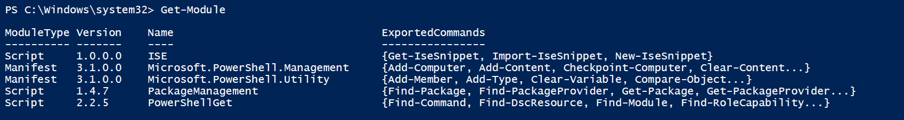
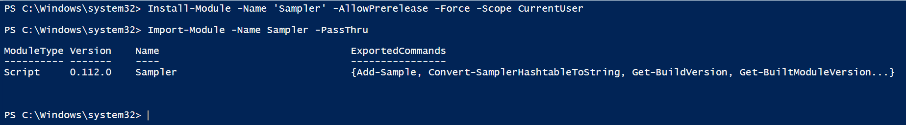

# PowerShell DSC & Sampler

## Setup PowerShellGet

### **Step-1:** Run following command

> Install-PackageProvider -Name NuGet -Force

### **Step-2:** Check if you have PowerShellGet by running following command

> Get-Module

### **Step-3:** If you already have PowerShellGet, then run following command
> Update-Module -Name PowerShellGet

If not, run following command

> Install-Module -Name PowerShellGet -Force

#

## Setup Pre-requisites

### **Step-1:** Install Git
> choco install git

### **Step-2:** Install Git.Version Portable

> choco install GitVersion.Portable

#

## Setup Sampler

### **Step-1:** Set powershell permissions
> Set-ExecutionPolicy -ExecutionPolicy RemoteSigned -Scope CurrentUser

### **Step-2:** Install Sampler

> Install-Module -Name 'Sampler' -AllowPrerelease -Force -Scope CurrentUser

### **Step-3:** Load Sampler

> Import-Module -Name Sampler -PassThru

