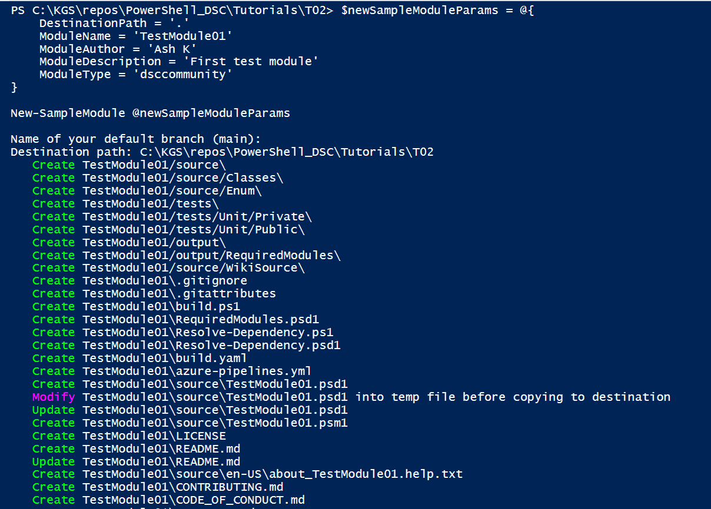
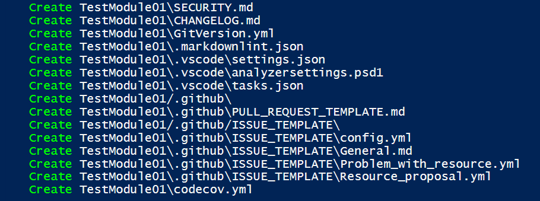
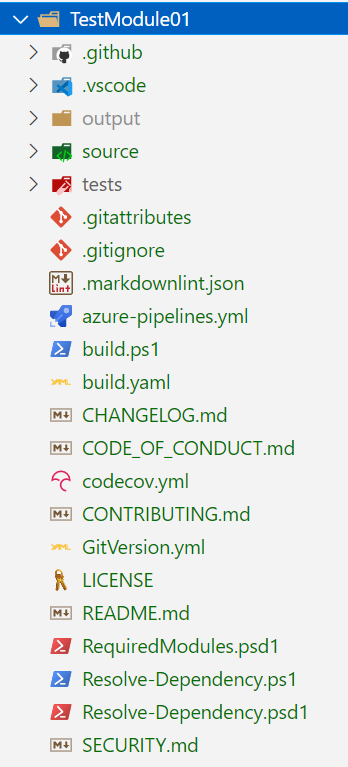

# Creating a module using Sampler

**Step-1:** Create parameter for module

```
$newSampleModuleParams = @{
    DestinationPath = '.'
    ModuleName = 'TestModule01'
    ModuleAuthor = 'Ash K'
    ModuleDescription = 'First test module'
    ModuleType = 'dsccommunity'    
}
```

**Step-1:** Create new module

```
New-SampleModule @newSampleModuleParams
```





You can check in your VS Code


{:height="45%" width="45%" style="border: 2px solid black"}


The Sampler creates a folder **TestModule01** which has all the files required for Module building, publishing and automation 