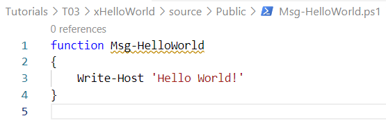
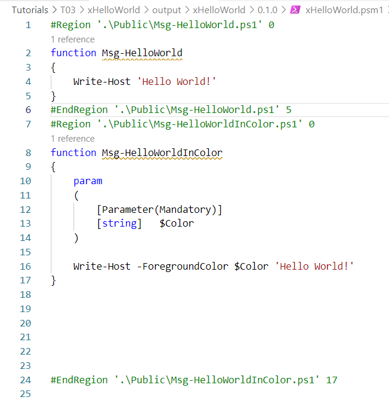

# Creating xHelloWorld module


In last tutorial, we ended up creating an empty module. In this one, we will create a module with a purpose and add some meat to it (some PowerShell functions)

Let us assume we want to create a module named **xHelloWorld**

So let us create a couple of PowerShell functions that will be *packaged* inside this module **xHelloWorld**

## **Step-1:** Create PowerShell functions

```
function Msg-HelloWorld
{
    Write-Host 'Hello World!'
}

function Msg-HelloWorldInColor
{
    param
    (
        [Parameter(Mandatory)]
        [string]   $Color
    )

    Write-Host -ForegroundColor $Color 'Hello World!'
}


```

## **Step-2:** Create module xHelloWorld


```
$newModuleParams = @{
    DestinationPath = '.'
    ModuleName = 'xHelloWorld'
    ModuleAuthor = 'AshishK'
    ModuleDescription = 'xHelloWorld module'
    ModuleType = 'dsccommunity'
}
```

```
New-SampleModule @newModuleParams
```


You can check module in VSCode as shown below


## **Step-3:** Adding PowerShell functions to Module

As shown below, create a folder named **Public** under *Source* folder and create a file named *Msg-HelloWorld.ps1* inside Public folder.

Paste our powershell functions inside the file


#



## **Step-4:** Building the Module

Now let us build the module.

Change the path of command prompt to root of xHelloWorld module

> C:\KGS\repos\PowerShell_DSC\Tutorials\T03\xHelloWorld

And execute build command

> .\build.ps1

When you execute build command first time, it will download all the dependant modules from internet and hence it will take some time to complete.

**Build result:**

As soon as the build started, it recognized that there are missing dependencies. Hence it executed the following command to download those dependenciesa

> ./build.ps1 -ResolveDependency -Task noop

So the build command can take parameters. In above case, it executed with parameters to get dependent packages and it executed a **Task** called NoOperation (noop)


#


Looks like our build failed.
Reason: **Code Coverage FAILURE: 0 % is under the threshold of 85 %.**

Since we have not written any test yet, there is no code coverage. 

So let us change this threshold to "zero" for now.

For this, open the file named **build.yaml** and change value on line 88 from "85" to "0"


Now lets run the build command again

> .\build.ps1

This time we see that the build completed successfully.


**Build Output:**


We can see that build created a new module for us (xHelloWorld) in **output** folder

Also, if you check contents of file *xHelloWorld.psm1* under **Modules** folder, you will find our 2 PowerShell functions




Hooray!!!
We successfully built a module and encapsulated our 2 powershell functions in it. 

Now let us try to execute these functions

## **Step-5:** Running the Module

Now if we want to check the module, we can do so by running following command

> Get-Module xHelloWorld


Now let us execute both of our PowerShell functions


As you can see, we were able to successfully call both functions.

And second function was called a couple of times by passing a different **Color** as input parameter.


## **Step-6:** Clean up of unwanted sections

We see that inside our xHelloWorld module, it has bundled another folder with name "Modules".


This can contain any dependencies that our PowerShell functions have.
Since we do not have any dependency, let us clean this up a little bit.

For this, open build.yaml file and comment line 23 to 28, as shown below


Now run build again and see what happens


You can see that our xHelloWorld module code looks a lot cleaner now.

