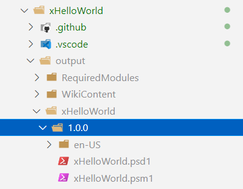
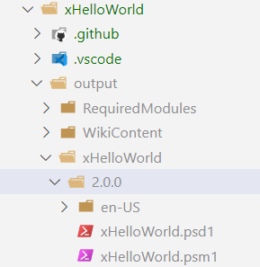

# Module Versioning

We see that no matter how many times we build, the module is created with the same version number **0.1.0**

So in this tutorial, let us learn how to set the version number manually.
Later on, we will see how we can increment the version number automatically on every change.

## **Step-1:** Set version number

Create a PowerShell variable called **ModuleVersion** and set its value as follows

> $ModuleVersion = '1.0.0'

Now if you bump up the version

> $ModuleVersion = '2.0.0'

You will see it stamps the new version number while creating the module.

