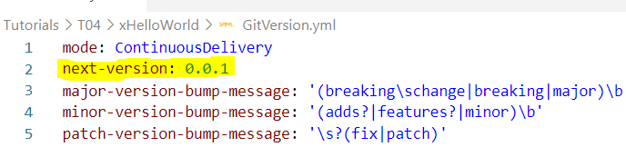
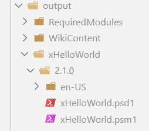

# Module Versioning

We see that no matter how many times we build, the module is created with the same version number **0.1.0**

So in this tutorial, let us learn how to set the version number manually.
Later on, we will see how we can increment the version number automatically on every change.

## **Step-1:** Set version number manually

Create a PowerShell variable called **ModuleVersion** and set its value as follows

> $ModuleVersion = '1.0.0'

Now if you bump up the version

> $ModuleVersion = '2.0.0'

You will see it stamps the new version number while creating the module.

## **Step-2:** Set version number using GitVersion.yml file

You will see a GitVersion.yml file bundeled with xHelloWorld module.
The file contains configuration that will be used for automatic incrementing of version number as per the defined parameters.

The value of **next-version** is used as seed value for stamping version number and on every build, the value is incremented by checking git history.

So let us change <u>next-version to 2.0.0</u> and build the code.

You can see result of build above. It will take seed value of *2.0.0* and bump up the minor version by 1, to stamp version number of **2.1.0**
