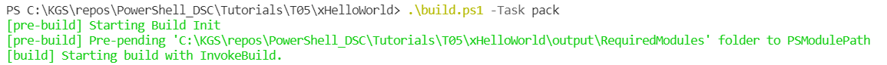
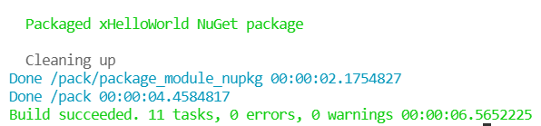
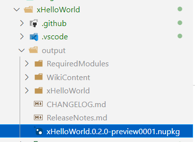

# Module Packaging

After module is ready, we can run the following command to package it.

> .\build.ps1 -Task pack

#

#

As you can see above, our xHelloWorld module has been package successfully into a **.nupkg** file